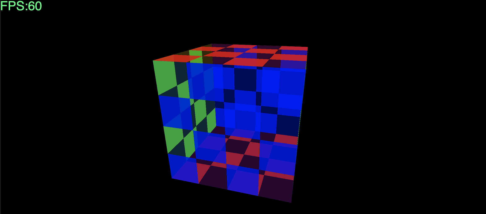

# About app
You can see the most recent version [here](https://kjamrozy.github.io/glsl-rotating-cube/).

A rather simple app that uses WebGL and React.js to display a rotating cube that assignes red, green and blue colors to the pair of opposite faces. Each cube face has a semi-transparent checkboard imbued into it. If mouse moves over a cube's face its alpha gets bumped up by `0.2`.

Code for detection of the face under the mouse is located in the vertex shader as opposed to the standard way of dealing with this on the JS side. Vertex attribute data is also very minimal. Only vertex index and cube's face index is passed to the vertex shader. During redraw only `current time`, `mouse x&y` and `canvas width&height` are passed to the WebGLProgram with use of `uniform1fv`.

# Build steps
Please use something like Node.js v17 or higher(maybe older version would also work but that's not granted)/
1. `yarn install` / `npm install`
2. `yarn serve` / `npm run serve` to build app and open it as the [localhost:8080](http://localhost:8080/) in the default browser.
